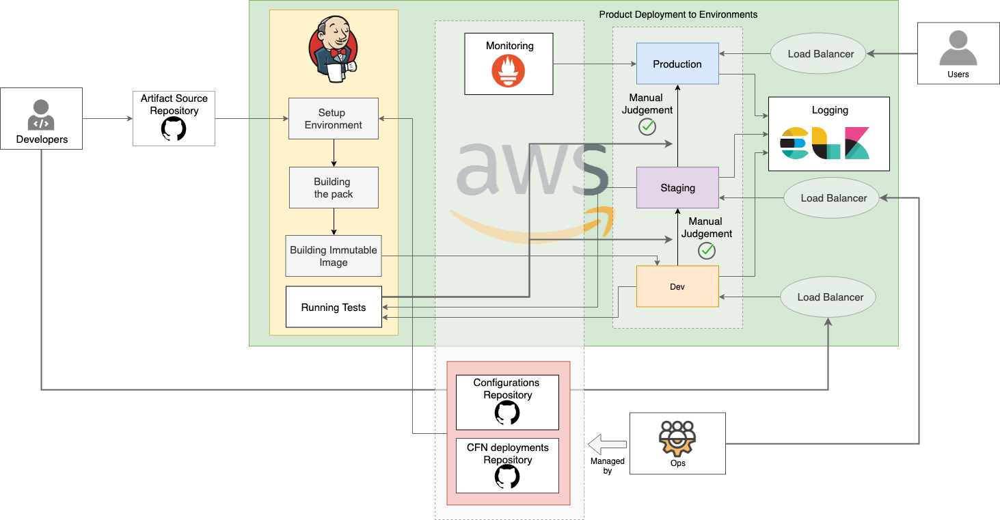

# Resources for WSO2 AWS Pipeline
> **Warning**
>
>   The CICD pipeline is deprecated.
>

### Overview

* WSO2 AWS Pipeline provides tools and a preconfigured pipeline used for continuous integration and deployment of WSO2 products. The setup is deployed on top of AWS using [CloudFormation](https://aws.amazon.com/cloudformation/).

* This pipeline has end to end automation from initiating automatic builds to deploying in different environments on AWS.

* This pipeline uses the AWS Jenkins Pipeline plugin that builds, tests and deploys the code, each time it is edited.
This pipeline expands with continuous integration by deploying all code changes to development and staging environments and thereafter, to the production environment.

* Following are the tools used to install and monitor the pipeline.

  - Jenkins: For continuous integration

  - AWS CloudFormation: For continuous deployment to AWS

  - ELK: For centralized logging

  - Prometheus: For monitoring deployments and visualization using Grafana
  

### Installation

Use the following, **Getting Started** guides to install the AWS Pipeline, for the respective WSO2 product.

* [Getting Started with AWS Pipeline for WSO2 Enterprise Integration](docs/getting-started-ei.md)

* [Getting Started with AWS Pipeline for WSO2 Identity and Access Management](docs/getting-started-is.md)

* [Getting Started with AWS Pipeline for WSO2 API Management](docs/getting-started-apim.md)

## How You Can Contribute

For detailed information on how you can contribute to this Git repository, please refer [this](CONTRIBUTING.md) documentation.
